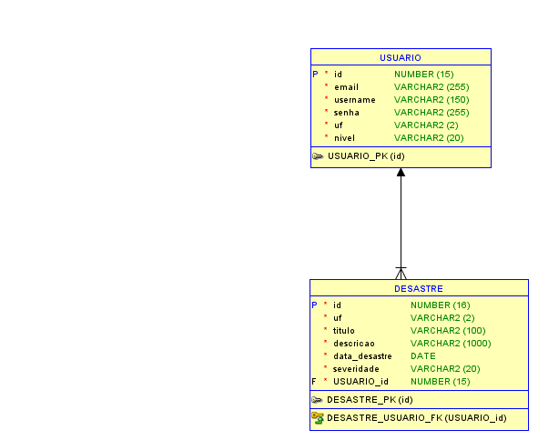
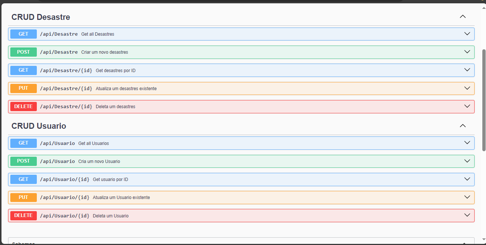

# Advanced Business Development with .NET

## Integrantes

- **Erick Alves**  
  GitHub: [Erick0105](https://github.com/Erick0105)  
  RM: 5568682

- **Vicenzo Oliveira**  
  GitHub: [fFukurou](https://github.com/fFukurou)  
  RM: 554833

- **Luiz Henrique**  
  GitHub: [LuizHNR](https://github.com/LuizHNR)  
  RM: 556864

---

## Link do Vídeo Explicativo:

https://youtu.be/dSaWacopmz0

## Link do Pitch:

https://youtu.be/55PfbdSWxNo

---

## Descrição do Projeto

Este projeto foi desenvolvido no contexto do curso **Advanced Business Development with .NET**, com foco em soluções avançadas para negócios usando a plataforma .NET.

O projeto aborda:

- Desenvolvimento backend com .NET
- Integração com bancos de dados
- Testes automatizados
- Documentação clara e visual

---

## Diagramas

Abaixo estão alguns diagramas do projeto, mostrando a arquitetura, fluxo de dados e estrutura das camadas:




---

## Desenvolvimento

O projeto foi desenvolvido com as seguintes tecnologias e frameworks:

- **.NET 8**
- **C#**
- **Entity Framework Core**
- **SQL Server**
- **Swagger** (para documentação de APIs)

Principais funcionalidades:

- Sistema de login e autorização JWT
- Operações CRUD completas
- Integração com serviços externos via REST APIs
- Interface web básica para visualização de dados

---

## Parte de Testes

Exemplo de resultados de teste:



---

## Instruções para Acesso

1️⃣ Clone o repositório:

```bash
git clone https://github.com/deu-ruim/Advanced-Business-Development-with-.NET.git
```

2️⃣ Acesse a pasta do projeto:

```bash
cd Advanced-Business-Development-with-.NET
```

3️⃣ Configure o arquivo `appsettings.json` com as credenciais do seu banco.

4️⃣ Execute a aplicação:

```bash
dotnet run
```

5️⃣ Acesse a documentação Swagger:

```
http://localhost:5201/swagger/index.html
```

---

## Exemplos de Testes

Execute os testes:

```bash
dotnet test
```

Exemplo de saída esperada:

```
Passed!  - Failed: 0, Passed: 25, Skipped: 0, Total: 25
```
